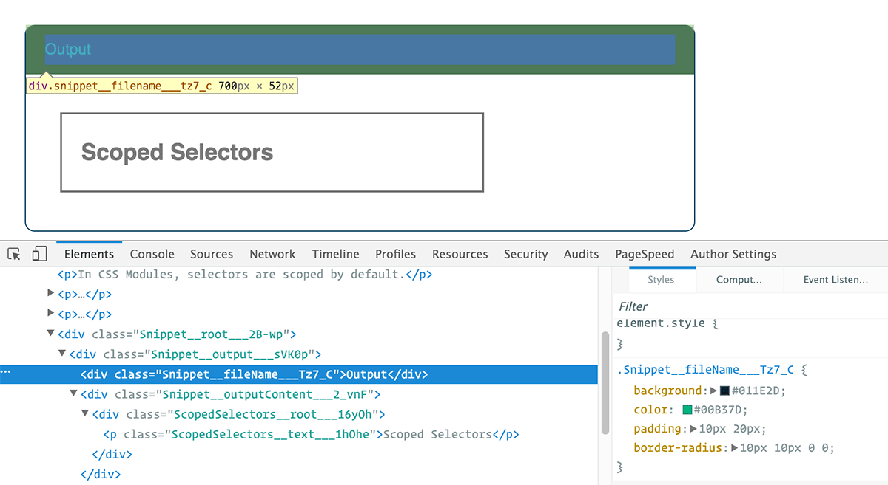

[原文地址](https://css-tricks.com/css-modules-part-1-need/?ref=webdesignernews.com)

#什么是CSS模块
根据这个[资源](https://github.com/css-modules/css-modules),CSS模块的定义是：
> CSS文件中的所有的类名和动画名默认被局限在一定范围内。

因此所谓的CSS模块不是一个正式的规范或者是浏览器默认支持的实现，而是(Webpack或Browserify)项目构建中的一步：通过改变类名来限制选择器（类似命名空间）。

这么做会变成什么样，我们为什么这么做？后面会有一个小例子来说明这些。首先，请回想下原生HTML和CSS是如何工作的。**class**属性被添加在HTML标签当中：

```html
<h1 class='title'>An example heading</h1>
```

该类名属性的样式会被写在CSS当中：

```css
.title{
  background-color: red;
}
```

只要这个CSS样式被应用在这个HTML文档中，`<h1>`标签的背景就一直是红色的。我们不需要处理CSS或者HTML。浏览器了解他们的格式，并且知道如何去处理。

但是CSS模块使用了完全不同的方法。与上例写在HTML中不同，我们需要将所有的标签写在JS文件当中，例如：*index.js*。下面又有一个例子告诉我们它是如何实现的。

```js
import styles from './styles.css';

element.innerHTML = `
  <h1 class="${styles.title}" >
    An example heading
  </h1>`;
```

在构建的过程中，编译器会查找我们在文件头部引用的`styles.css`文件，然后浏览JS文件，并让`.title`类与`styles.title`相关联。接下来的构建过程会让上面的代码变得完全不同，通过一个新的字符串替换HTML和CSS类选择器，使HTML和CSS文件分离。
最后生成的HTML标签可能如下：

```html
<h1 class="_styles__title_309571057">
  An example heading
</h1>
```

生成的CSS代码如下

```css
._styles__title_309571057 {
  background-color: red;
}
```



类名属性和`.title`选择器完全变了。浏览器并没有执行原来的CSS代码。
正如[Hugo Giraudel](http://www.sitepoint.com/understanding-css-modules-methodology/)在他的教程中所讲的一样：
> 这些类名都是自动生成，独一无二，并且会自动映射对应的样式。

这说明了样式的作用域，他们被限制在特定的模板中。如果我们有一个`buttons.css`文件，我们只会在`buttons.js`文件中引用它。除非我们特地引用`buttons.css`文件，否则`.btn`这一类样式是不允许被其他模板引用的(例如:`forms.js`)。

为什么我们想要将HTML和CSS混用在一起呢？为什么我们希望它如此工作？

#我们为什么要用CSS模块？
通过使用CSS模块，它确保组件的样式统一。
1. 存在在一处。
2. 只对确定组件起作用。

另外，任何组件都可以有一个依赖，比如：

```js
import buttons from "./buttons.css";
import padding from "./padding.css";

element.innerHTML = `<div class="${buttons.red} ${padding.large}">`;
```

**设计这一方法是为了修复CSS全局作用域的问题。**
* 你曾经是否为了赶进度、节省时间把所有代码写在一处，而没有考虑这么做会有什么影响？
* 你是否有过在CSS样式代码的底部遗留了一堆垃圾代码，想要重构，但是却只是说说？
* 你是否遇到过不清楚自己样式表里的内容是否有效，或者某些代码是否被使用的情况？
* 你有没有想过你可以在保持网页样式的前提下去掉一些样式代码？或者某一样式仅仅是依赖其他代码被其他样式所覆盖？

这些问题真是令人头疼啊。
使用CSS模块和其局限作用域的思想，就可以避免上述问题。当你写样式的时候总是需要强迫自己想
后果是什么样。

例如：如果你在HTML中添加`random-gross-class`，没有使用CSS模块化样式。因为CSS选择器会被转化成`._style_random-gross-class_0038089`,所以这个样式不会被渲染出来，

#`composes`关键字
假如我们有个`type.css`的模块，用来渲染文字样式。

```css
.serif-font {
  font-family: Georgia, serif;
}

.display {
  composes: serif-font;
  font-size: 30px;
  line-height: 35px;
}
```

我们会在组件模板中像下面这样进行声明：

```js
import type from "./type.css";

element.innerHTML = 
  `<h1 class="${type.display}">
    This is a heading
  </h1>`;
```

会被转换成以下标签样式：

```html
<h1 class="_type__display_0980340 _type__serif_404840">
  Heading title
</h1>
```

两个类都被`composes`关键字组合绑定到一块。这种方法与Sass的`@extend`相似，避免出现类似解决方案重复的问题。
我们也可以将不同CSS文件中的样式`组合`到一块。

```css
.element {
  composes: dark-red from "./colors.css";
  font-size: 30px;
  line-height: 1.2;
}
```

#非必需的BEM
通过使用CSS模块，我们就不是很需要使用[BEM](https://css-tricks.com/bem-101/)
1. 简单解析： 像`type.display`这种类名对于开发者来说已经足够像遵守BEM-y规则的`.font-size__serif--large`类名一样清晰易懂了。BEM选择器越长可能更容易被理解编译。
2. 局部作用域：比如在CSS模块中我们有`.big`这个样式用来修改**字体大小**。然而我们在其他组件中用这个样式来修改边距和字体大小，但是不要担心，由于CSS模块的作用域局限性，它们之间不会产生冲突。即使它们在同一组件内被引用，由于设定的命名空间的不同，它们之间也不会产生相互覆盖。换句话说，CSS中常见的重名问题在CSS模块中都不是问题。

（译者）写在最后：作为英语四级勉强过线选手，如果翻译有不到位地方，请多包涵。如若不能包涵就请跟着链接跳转看原文。当然，如果你感觉文章内容不错，就我给个star吧。