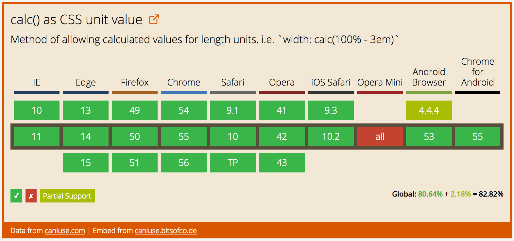

**CSS3**提出了`calc()`这一方法，允许我们在设定样式值的时候使用数学公式来代替之前的值声明。例如元素的固定宽度，我们可以使用`calc()`方法来指定宽度值，其中两个或多个数值进行相加。
```CSS
.foo {
  width: calc(100px + 50px);
}
```

##为什么要使用`calc`？
如果之前有使用过CSS的预编译工具，比如SASS。上例中的内容，你或许已经体验过了。
```CSS
.foo {
  width: 100px + 50px;
}
```
```SCSS
$width-one: 100px;
$width-two: 50px;
.bar {
  width: $width-one + $width-two;
}
```
但`calc()`方法提供了更好的解决方式。首先，我们在`calc`中可以使用不同单位的值。即我们可以将**百分比**和**像素值**混合在一起使用。比如我们可以创建一个从百分比上减去像素值：
```CSS
.foo {
  width: calc(100% - 50px);
}
```
在该例子中，**`.foo`**元素相对其父元素宽度的`100%`总会少`50px`。
然后，`calc()`方法的**计算值是表达式本身**，并不是表达式的结果值。当我们在CSS预编译器中使用数学表达式时，浏览器得到的值是表达式的结果值。
```CSS
// Value specified in SCSS
.foo {
    width: 100px + 50px;
}

// Compiled CSS and computed value in browser
.foo {
    width: 150px;
}
```
但使用`calc`的话，浏览器获得的仍然是`calc()`表达式本身。
```CSS
// Value specified in CSS
.foo {
    width: calc(100% - 50px);
}

// Computed value in browser
.foo {
    width: calc(100% - 50px);
}
```
这么做的意义在于此时值在浏览器中会能更动态，并且能适应浏览器视口的改变。我们可以有一个元素高度的视窗减去一个固定值，并能够适应随着视窗的变化。

##使用`calc()`
`calc()`方法中可以使用**加减乘除**进行数值运算，它可以用于**长度、频率、角度、时间、数值或取整等类型**的计算[（CSS 数据类型）](https://bitsofco.de/generic-css-data-types/)
举个栗子：
```CSS
.foo {
    width: calc(50vmax + 3rem);
    padding: calc(1vw + 1em);
    transform: rotate( calc(1turn + 28deg) );
    background: hsl(100, calc(3 * 20%), 40%);
    font-size: calc(50vw / 3);
}
```
###组合`calc`
`calc`方法可以组合。
```CSS
.foo {
    width: calc( 100% / calc(100px * 2) );
}
```
上述例子会被计算成如下形式：
```CSS
.foo {
    width: calc( 100% / (100px * 2) );
}
```

###Fallback
`calc()`支持相对较好
[](http://bitsofco.us10.list-manage.com/track/click?u=282459d63a019df7bb8ca2e92&id=fad8b66cbe&e=c157677b00)

For browsers that don't support calc() as a value, the entire property-value expression is ignored. This means that we can easily provide a fallback static value that will be used by non-supporting browsers.
对于不支持`calc()`的浏览器，整个属性都会被忽略掉。为此我们可以提供一个简单的回退机制。
```CSS
.foo {
    width: 90%; /* Fallback for older browsers */
    width: calc(100% - 50px);
}
```

##何时使用`calc()`?
`calc()`方法在许多情景下都非常有用。
###栗子1——居中元素
使用`calc()`可以给困扰我们多年并永远没有尽头的问题--元素垂直居中多一个新的解决方法。如果我们知道子元素尺寸，我们就可以使用经典的负边距移动元素位置的方法来解决该问题。
```CSS
// Assuming .foo is 300px height and 300px width
.foo {
    position: absolute
    top: 50%;
    left: 50%;
    marging-top: -150px;
    margin-left: -150px;
}
```
使用`calc()`我们可以只需设定**`top`、`left`**属性
```CSS
.foo {
    position: absolute
    top: calc(50% - 150px);
    left: calc(50% - 150px);
}
```
###栗子2——Creating a Root Grid Size
`calc`可以基于视窗和`rem`来制作的自适应的栅格系统。我们可以设定根元素的字体大小为视窗宽度的一部分。
```CSS
html {
    font-size: calc(100vw / 30);
}
```
现在`1rem`是整体视窗宽度的1/30，在此页面的任何文字都会随着视窗的大小改变而动态变化。
如果我们对无文字的元素DOM使用`rem`单位，他们也同样会有效。元素宽度设置为**`1rem`**，其宽度也会为视图宽度的1/30。
###栗子3——更清晰
使用`calc()`方法能够令计算看起来更明显。举个栗子，如果你希望子元素占父元素宽度的1/6，你可以用如下方式
```CSS
.foo {
  width: 16.6666666667%;
}
```
但我相信如下方式你阅读起来会更清晰：
```CSS
.foo {
  width: calc(100% / 6);
}
```