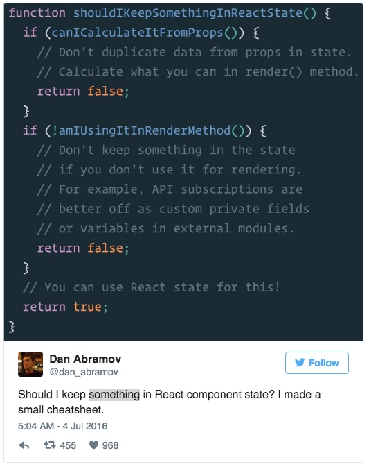
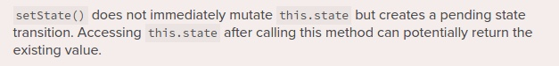

#动机
最近，对于如何处理`React`中的状态信息有许多的争论。一些人声称`setState()`没有如期望的方式工作。你必须使用类似Flux的状态容器来具体化状态信息并且完全避免使用组件信息。

但在另一方面，仍有许多人担心上面的误解最终会变成教条。


因为兴趣而添加外部状态信息容器，或者由于教程告诉你要如此做听起来不是个好的技术决策标准。
清楚的说，使用类似Redux、MobX之类的外部状态容器没有错。事实上他们非常好用并且有很广泛的生态系统来适应你的需求。但事实是你不一定非要或一开始就使用他们。

如果你是在scratch上学习的React，Pete Hunt发布了[最佳建议](https://github.com/petehunt/react-howto)。甚至Redux的作者[Dan Abramov](https://medium.com/u/a3a8af6addc1)也建议：


这意味着你需要在使用Flux处理之前，能先理解如何使用React的方式处理状态信息。

不使用Flux你仍然可以开发出一个完整的应用，组件可以分为两类：[容器和表现层](https://medium.com/@dan_abramov/smart-and-dumb-components-7ca2f9a7c7d0#.y6t3ajszk)。这样你可以获得重用性和可维护性。这样同时也可以在后期引入Flux，迁移路径也会更清晰，在最后才需要决定使用哪种方案。

即使你已经在之前就使用了Flux，在某些情况下你仍应该使用**组件状态信息**。比如你希望跨项目分享你的组件，因此你的组件必须是独立且属性独立包含的。在此情况下，你真的不需要再使用状态容器作为依赖了。

我的观点如下：
* 社区中关于如何处理React状态信息的看法，具有一定误解并且缺乏对其的充分了解。
* 想要拥抱React所有功能，理解如何处理状态信息是至关重要的。
* 假如不需要，千万不要添加复杂层给你的应用。切记： [simplicity matters.](https://medium.com/javascript-scene/the-single-biggest-mistake-programmers-make-every-day-62366b432308#.k2b2mk5ee)。

以下的常见FAQ的目的是降低处理React状态信息的复杂度。

##状态信息如何工作？
React组件类似于状态机，用于展示用户接口信息。每个用户的动作都可能会触发状态机的改变，然后新状态会在新渲染的组件中表现出来。

React存储组件状态信息在`this.state`。可以使用两种方式设定初始值给`this.state`。

```JavaScript
// Using React.createClass
var Counter = React.createClass({
    getInitialState: function() {
        return {counter: 0};
    },
    ...
});
// Using ES6 classes
class Counter extends React.Component {
    constructor(props) {
        super(props);
        this.state = {counter: 0};
    }
    ...
}
```

状态信息可以通过以下方式更改：
```JavaScript
this.setState(data, callback);
```

该方法会使用**data**对`this.state`数据做一次浅覆盖，然后重新渲染组件。**data**参数可以为对象或返回结果为包含对应关键字对象的方法。**callback**方法为可选的，如果我们选择传入会在组件重渲染之后执行。React会保证你状态数据的更新，所以你很少会用到回调函数。
**下面让我们看下例子：**

```JavaScript
class Counter extends React.Component {
    constructor(props) {
        super(props);
        this.state = {count: 0};
        this.incrementCounter = this.updateCounter.bind(this, 1);
        this.decrementCounter = this.updateCounter.bind(this, -1);
    }
    
    render() {
        return (
            <div>
                <div>{this.state.count}</div>
                <input type='button' value='+' onClick={this.incrementCounter} />
                <input type='button' value='-' onClick={this.decrementCounter} />
            </div>
        );
    }
    
    updateCounter(count) {
        this.setState({count: this.state.count + count});
    }
}
```

###哪些信息要存放在React的状态信息中？
Dan Abramov 在一条tweet中回复这一问题:



首先，不要复制`props`传入的参数给`state`,不管其是不是要用在`render()`方法中的。

```javascript
// Don't duplicate data form props in state
// Antipattern
class Component extends React.Component {
    constructor(props) {
        super(props);
        this.state = {message: props.message};
    }
    
    render() {
        return <div>{this.state.message}</div>;
    }
}
```

上述例子问题在于`state`应该在组件创建之初就被声明。当新的`props`参数传入，`state`值不变因此不会重新渲染组件。因此，此时推荐你使用`componentWillReceiveProps()`方法来更新状态重渲染组件 ---- 单一**数据来源才是王道**。因此你可以使用以下方式避免问题：

```JavaScript
// Better example
class Component extends React.Component {  
    componentWillReceiveProps(...){
      // do someting and return true of false 
      // to let React know weather or not render the Component
    }
    render() {
        return <div>{this.props.message}</div>;
    }
}
```

同样当你的状态信息是基于`props`参数计算得来的时候：

```JavaScript
// Don't hold state based on props calculation
// Antipattern
class Component extends React.Component {
    constructor(props) {
        super(props);
        this.state = {fullName: `${props.name} ${props.lastName}`};
    }
    
    render() {
        return <div>{this.state.fullName}</div>;
    }
}
// Better approach
class Component extends React.Component {    
    render() {
        const {name, lastName} = this.props;
        return <div>{`${name} ${lastName}`}</div>;
    }
}
```

尽管基于`props`设定初始`state`没有错，但这么做的前提是需要你能了解它只是初始种子数据。
```JavaScript
// Not an antipattern
class Component extends React.Component {
    constructor(props) {
        super(props);
        this.state = {count: props.initialCount};
        this.onClick = this.onClick.bind(this);
    }
    
    render() {
        return <div onClick={this.onClick}>{this.state.count}</div>;
    }
    
    onClick() {
        this.setState({count: this.state.count + 1});
    }
}
```

最后，但并不是最不重要的一个：
```JavaScript
// Don't hold state that you don't use for rendering.
// Leads to unneeded re-renders and other inconsistencies.
// Antipattern
class Component extends React.Component {
    constructor(props) {
        super(props);
        this.state = {count: 0};
    }
    
    render() {
        return <div>{this.state.count}</div>;
    }
    
    componentDidMount() {
        const interval = setInterval(() => (
            this.setState({count: this.state.count + 1})
        ), 1000);
        this.setState({interval});
    }
    componentWillUnmount() {
        clearInterval(this.state.interval);
    }
}
//Better approach
class Component extends React.Component {
    constructor(props) {
        super(props);
        this.state = {count: 0};
    }
    
    render() {
        return <div>{this.state.count}</div>;
    }
    
    componentDidMount() {
        this._interval = setInterval(() => (
            this.setState({count: this.state.count + 1})
        ), 1000);
    }
    componentWillUnmount() {
        clearInterval(this._interval);
    }
}
```

###`setState()是异步的？`
当然！
当你使用`setState()`方法时，React会安排一个更新，由于需要计算因此延迟是必不可少的。React文档对这一点有所误导：

显然这两句话存在矛盾，下面我们做个实验看看会发生什么：
```JavaScript
class Component extends React.Component {
    constructor(props) {
        super(props);
        this.state = {count: 0};
        this.onClick = this.onClick.bind(this);
    }
    
    render() {
        return <div onClick={this.onClick}>{this.state.count}</div>;
    }
    
    onClick() {
        this.setState({count: this.state.count + 1});
        console.log(this.state.count);
    }
}
```

当组件渲染完成并且可以互动时，你会在控制台看到值的变化。**这是由于React拥有事件，并且知道如何批处理更新**。
结果：状态信息异步更新。
但是，当事件来自于外部数据源时会发生什么呢？
```JavaScript
// Calling setState() twice in the same execution context is a bad // practice. It's used here for illustration purposes. Instead use // an atomic update in real code 
class Component extends React.Component {
    constructor(props) {
        super(props);
        this.state = {count: 0};
    }
    
    render() {
        return <div>{this.state.count}</div>;
    }
    
    componentDidMount() {
        this._interval = setInterval(() => {
            this.setState({count: this.state.count + 1});
            console.log(this.state.count);
            this.setState({count: this.state.count + 1});
            console.log(this.state.count);
        }, 1000);
    }
componentWillUnmount() {
        clearInterval(this._interval);
    }
}
```
即使在同一执行环境中调用`setState()`两次，如文档所说明的返回已有值。这是由于React不知道如何尽可能快的更新状态信息。
这一点很棘手，因此我建议一直视`setState`为异步，这样会避免麻烦。

###我听说在某些特定环境下调用`setState()`不会触发重渲染，那都有哪些情景？
1. 当你在`componentWillMount()`或`componentWillRecieveProps()`方法中调用`setState()`时，它不会触发额外的React更新批处理。
2. 当`shouldComponentUpdate()`返回`false`时，`render()`方法会完全跳过`componentWillUpdate()`和`componentDidUpdate()`方法。 

##总结
在React中正确处理状态信息是个挑战，现在希望你现在能有个清晰的思路了。

[How to handle state in React. The missing FAQ.
](https://medium.com/react-ecosystem/how-to-handle-state-in-react-6f2d3cd73a0c#.6nkftjnc2)

