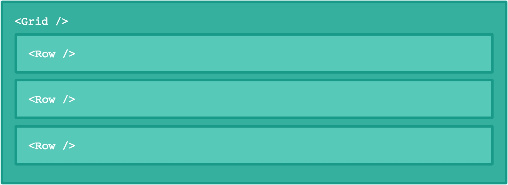
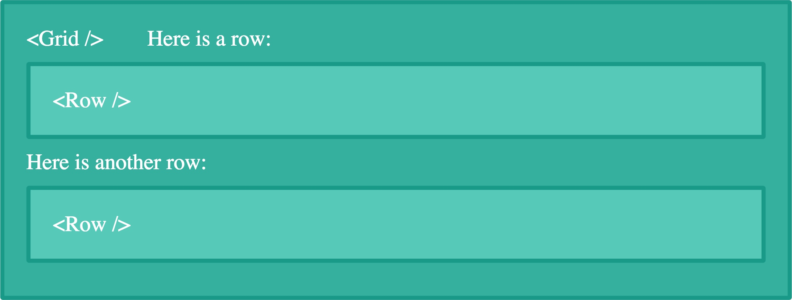
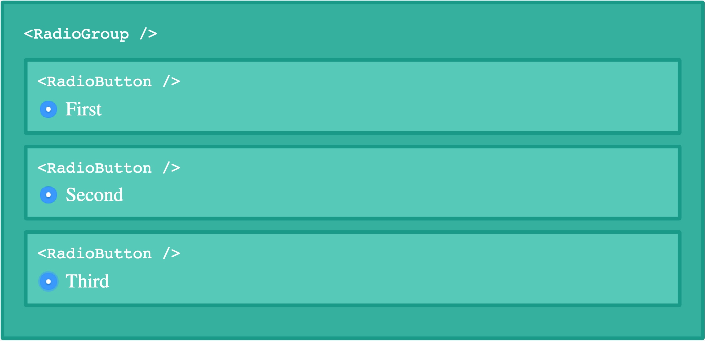
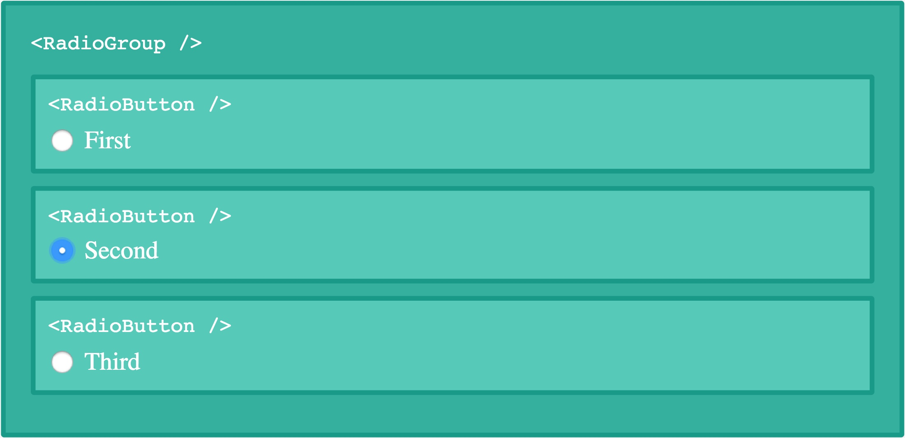

#深入React的`children`
React设计思想的核心是组件化，通过JSX语法你可以像HTML标签一样简单的编写叠加各个组件。

当我第一次学习React，我认为"使用`props.children`"就是所有的东西了。**但是，我错了！**

因为我们现在使用的是JavaScript，所以我们可以更改子组件。通过传递特殊属性来决定是否渲染或者控制这些子组件。现在让我们发现React`children`属性的能力。

#子组件
此时我们拥有一个`<Grid />`组件，其中可以包含`<Row />`组件使用形式如下：
```JavaScript
<Grid>
  <Row />
  <Row />
  <Row />
</Grid>
```

此时传入了三个**`Row`**组件作为`props.children`到**`Grid`**组件当中。使用**表达式的父组件**可以渲染它的子组件。
```JavaScript
class Grid extends React.Component {
  render() {
    return <div>{this.props.children}</div>
  }
}
```
父组件同样可以在渲染之前就决定是否渲染或者操作子组件。例如`<Fullstop />`组件不会渲染它的子组件。
```JavaScript
class Fullstop extends React.Component {
  render() {
    return <h1>Hello world!</h1>
  }
}
```
无论给组件传入什么`children`，它永远都只会显示**Hello world!**
> 上面例子中的`<h1>`标签会渲染它的子组件"Hello world!"。

##Everything can be a child
React中的子元素不强制要求为组件，它可以是任何东西。例如，我们可以传递上例中的文本元素作为子元素给`<Grid />`，它可以正常展示出来。
```HTML
<Grid>Hello world!</Grid>
```


JSX会自动移除文本元素开头和结尾的空格符，同时也会将字符之间的空白符压缩为一个空格。这意味着以下例子中的文本最后会被渲染成同样。
```HTML
<Grid>Hello world!</Grid>

<Grid>
  Hello world!
</Grid>

<Grid>
  Hello
  world!
</Grid>

<Grid>

  Hello world!
</Grid>
```

你也可以给`<Grid />`中传入不同种类的子元素：
```HTML
<Grid>
  Here is a row:
  <Row />
  Here is another row:
  <Row />
</Grid>
```


##方法作为子元素
可以传入JavaScript表达式做子元素。下面给一个栗子来说明如何使用函数方法作为子元素：
```JavaScript
class Executioner extends React.Component {
  render() {
    // See how we're calling the child as a function?
    //                        ↓
    return this.props.children()
  }
}
```
你需要像如下的方式来传入方法作子组件：
```HTML
<Executioner>
  {() => <h1>Hello World!</h1>}
</Executioner>
```
上面的例子当然不是有用的，只是用来说明思想。
想象一个场景，你需要从服务端拉取数据。当然有许多方法能够做到这一点，其中就可以使用方法作为子元素来作为一种模式。
```HTML
<Fetch url="api.myself.com">
  {(result) => <p>{result}</p>}
</Fetch>
```
##控制子元素
如果你看过React的文档，会有这么一句话：“children are an opaque data structure（子元素是一个不透明的数据结构）”。此处说明`props.children`可以是任何类型，例如数组、方法、对象等。由于可以传入任何类型，因此你无法确定。

React在`React.Children`中提供了多种可用的帮助函数来控制子元素减少不必要的副作用。

###遍历子元素
`React.Children`中最常用的两个方法是`React.Children.map`和`React.Children.forEach`。它们的运行方式与数组内置方法中的相似，不同之处在于当传入的子元素为方法、对象或其他类型时依然能够运行。
```JavaScript
class IgnoreFirstChild extends React.Component {
  render() {
    const children = this.props.children
    return (
      <div>
        {React.Children.map(children, (child, i) => {
          // Ignore the first child
          if (i < 1) return
          return child
        })}
      </div>
    )
  }
}
```

`<IgnoreFirstChild />`组件会遍历所有子元素，返回除了首元素之外的所有子元素。
```HTML
<IgnoreFirstChild>
  <h1>First</h1>
  <h1>Second</h1> // <- Only this is rendered
</IgnoreFirstChild>
```


在这一🌰种，我们也可以使用`this.props.children.map`。但如果某人传入方法来作为子元素时会怎么样？`this.props.chilcren`会使用方法来代替数组，而且会报错！


使用`React.Children.map`方法，没有任何问题。
```HTML
<IgnoreFirstChild>
  {() => <h1>First</h1>} // <- Ignored 💪
</IgnoreFirstChild>
```

###计数子元素
由于`this.props.children`可以是任意类型，因此想要知道有多少个子组件是件很困难的事。如果传入的是一个方法的话，简单的使用`this.props.children.lengt`很可能会导致程序崩溃。如果我们传入的是一个"Hello world!"的字符串作为子组件，但是`.length`会返回**12**。
这也是为什么React会提供`React.Children.count`方法的原因：
```JavaScript
class ChildrenCounter extends React.Component {
  render() {
    return <p>React.Children.count(this.props.children)</p>
  }
}
```
无论什么类型的子组件都可以，输出结果如下：
```HTML
// Renders "1"
<ChildrenCounter>
  Second!
</ChildrenCounter>

// Renders "2"
<ChildrenCounter>
  <p>First</p>
  <ChildComponent />
</ChildrenCounter>

// Renders "3"
<ChildrenCounter>
  {() => <h1>First!</h1>}
  Second!
  <p>Third!</p>
</ChildrenCounter>
```
###转换子组件为数组
如果之前的方法都不让你满意，作为最后的方法。你可以使用`React.Children.toArray`将传入的子组件转换为数组的形式。这会很有用，例如在你想排序的情境下。
```JavaScript
class Sort extends React.Component {
  render() {
    const children = React.Children.toArray(this.props.children)
    // Sort and render the children
    return <p>{children.sort().join(' ')}</p>
  }
}
```
**输出：字符串被排序，同时渲染**
```HTML
<Sort>
  // We use expression containers to make sure our strings
  // are passed as three children, not as one string
  {'bananas'}{'oranges'}{'apples'}
</Sort>
```


##Enforcing a single child
回想之前我们写的`<Executioner />`组件，它要求只能传入一个方法作为子组件。
```JavaScript
class Executioner extends React.Component {
  render() {
    return this.props.children()
  }
}
```
我们可以使用`propTypes`的形式要求`props`中传入的类型。
```JavaScript
Executioner.propTypes = {
  children: React.PropTypes.func.isRequired,
}
```
这么做会在控制台输出一条消息，通常会被开发者忽略掉，因此我们可以将渲染方法放到`React.Children.only`方法中。
```JavaScript
class Executioner extends React.Component {
  render() {
    return React.Children.only(this.props.children)()
  }
}
```
这样会返回`this.props.children`的单一子组件。如果有多个子组件的话，会报错！

##修改子组件
我们本可以随意的渲染组件作为子元素，但仍然控制它的父组件而不是渲染出的子元素本身。为了具体说明，我们创建一个`RadioGroup`组件，其中可以多个`RadioButton`组件（渲染`<label>`标签包围一个`<input type='radio'>`标签）。

`RadioButton`不会被单独渲染，只有作为`RadioGroup`的子元素时才会被渲染。🌰：
```JavaScript
render() {
  return(
    <RadioGroup>
      <RadioButton value="first">First</RadioButton>
      <RadioButton value="second">Second</RadioButton>
      <RadioButton value="third">Third</RadioButton>
    </RadioGroup>
  )
}
```
上述代码会有一个问题，`input`标签没有分组。导致生成如下样式：

为了能将`input`标签分组，他们都需要`name`属性。我们强制要求各个`RadioButton`都赋值`name`属性。
```JavaScript
<RadioGroup>
  <RadioButton name="g1" value="first">First</RadioButton>
  <RadioButton name="g1" value="second">Second</RadioButton>
  <RadioButton name="g1" value="third">Third</RadioButton>
</RadioGroup>
```

但是这么做既乏味且容易出错，因此我们选择使用更适合的方式来告知`RadioGroup`我们子元素需要的`name`属性。

###修改子元素`props`属性
在`RadioGroup`中我们添加`renderChildren`新方法来修改子元素的属性。
```JavaScript
class RadioGroup extends React.Component {
  constructor() {
    super()
    // Bind the method to the component context
    this.renderChildren = this.renderChildren.bind(this)
  }

  renderChildren() {
    // TODO: Change the name prop of all children
    // to this.props.name
    return this.props.children
  }

  render() {
    return (
      <div className="group">
        {this.renderChildren()}
      </div>
    )
  }
}
```
现在让我们遍历所有子元素以获取各个子元素内容。
```JavaScript
renderChildren() {
  return React.Children.map(this.props.children, child => {
    // TODO: Change the name prop to this.props.name
    return child
  })
}
```
我们如何来修改他们的属性？

###无修改的克隆元素
`React.cloneElement`用来复制元素。我们在其中传入想要复制的元素作为第一个参数，第二个参数则可传入一个属性对象，用来赋值元素中所需的各个属性值。
```JavaScript
const cloned = React.cloneElement(element, {
  new: 'yes!'
})
```
此时复制的元素会带有{ new: 'yes!' }这一属性。

这一方法也是我们想要解决`RadioGroup`问题。克隆各个子元素，并且为其赋值`name`属性到其`this.props.name`当中。
```JavaScript
renderChildren() {
  return React.Children.map(this.props.children, child => {
    return React.cloneElement(child, {
      name: this.props.name
    })
  })
}
```
最后的步骤是传入一个独一无二的`name`属性给`RadioGroup`。
```JavaScript
<RadioGroup name="g1">
  <RadioButton value="first">First</RadioButton>
  <RadioButton value="second">Second</RadioButton>
  <RadioButton value="third">Third</RadioButton>
</RadioGroup>
```


成功生效！我们要求`RadioGroup`我们希望`RadioButton`的name属性为什么。它会帮我们自动做好，不需要我们再手动一个个输入了。

##总结
React的组件令子元素类似标记，而不是杂乱的实体。使用React提供的帮助函数和JavaScript，我们可以创建声明式的API，令工作更简单。

[原文链接：A deep dive into children in React](http://mxstbr.blog/2017/02/react-children-deepdive/)

