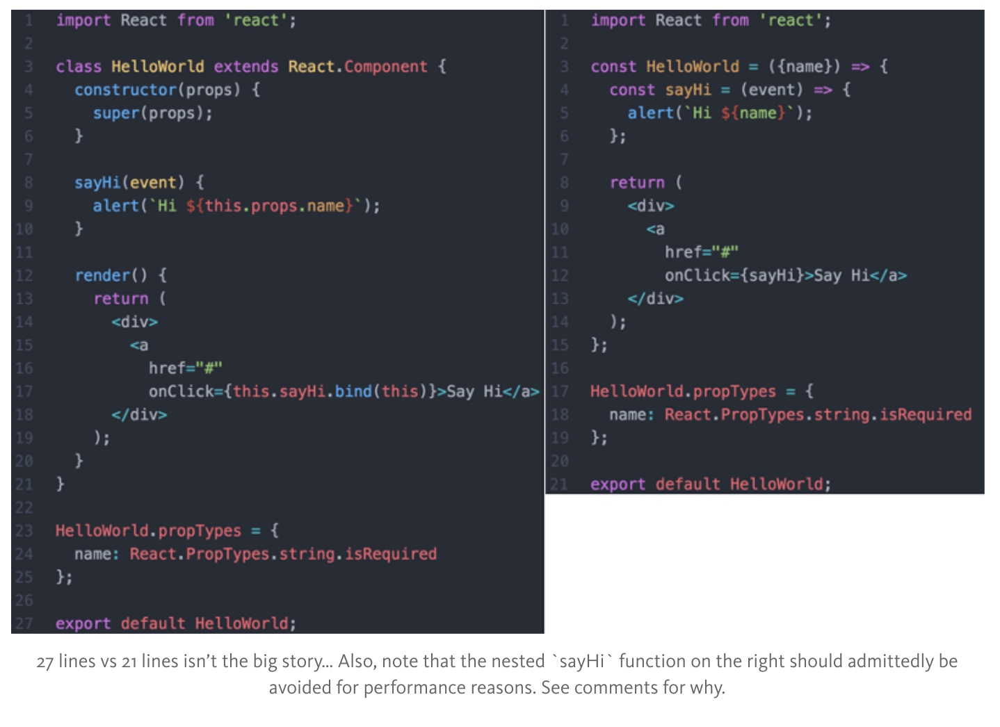

React .14版本引入了一种简单定义无状态组件的方法。该组件通过使用纯JavaScript函数的形式来定义。
**如下图所示：**


初见上述两种方法感觉相差不大，但是消除的问题却很多。

##No Class Needed
坦白来说，我觉得ES6的`class`语法糖有些过于复杂，在此使用纯函数更可取些。在上例中消除相关的构造函数`constructor`和`extends`使其更简洁。

##No `this` Keyword
如上例所示，无状态组件就只是个函数。因此，令人费解的**`this`**关键字就可以被避免掉了。使整个组件更加简单且容易理解，比较下列两种点击处理方法：
```JavaScript
onClick={this.sayHi.bind(this)}>Say Hi</a>
onClick={sayHi}>Say Hi</a>
```
在无状态组件中，`bind`关键字不是必需的。临时类不需使用`bind`方法来绑定`this`上下文。可以避免掉令许多开发人员困惑的`this`关键字，是很赞的。

##Enforced Best Practice
无状态组件通常被用于**简单显示组件**。它