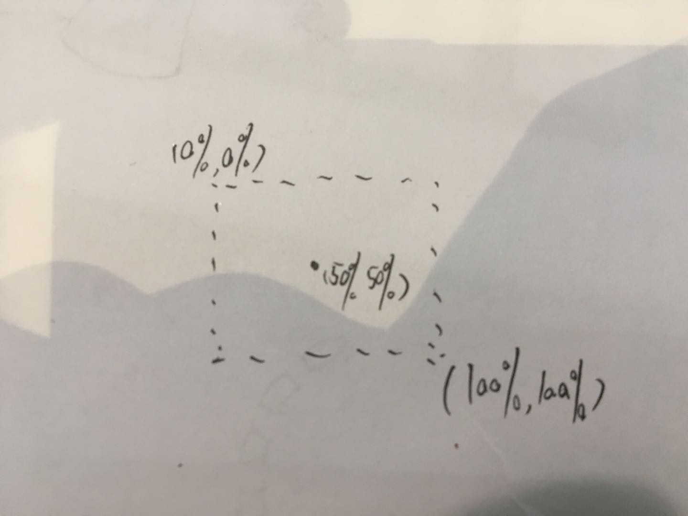
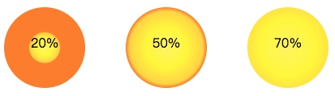
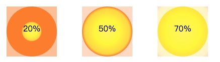
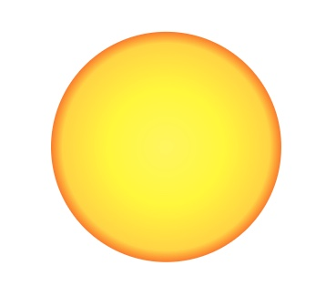
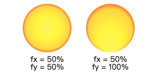
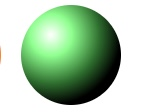

之前我们介绍过SVG的`<linearGradient>`了，通过设置`x`、`y`属性设定颜色渐变的方向，以达到颜色平滑变换的目的。

除此之外，SVG还具有径向渐变`<radialGradient>`。

在进行介绍之前，我们先初始化一个实例让你对经向渐变有个直观的了解。

```js
const defs = svg.append('defs')
defs.append('radialGradient')
   .attr('id', 'rg-1')
   .attr('r', '50%')
   .attr('cx', '50%')
   .attr('cy', '50%')
```

如上面代码，创建一个径向渐变元素`<radialGradient>`有点像是线性渐变和`<circle>`元素属性的混合。我们首先需要创建一个`<defs>`来进行声明，然后将需要声明的`<radialGradient>`添加在其中，并为其赋予唯一的id值以方便后面的填充引用。

再接下来设定径向渐变的起始点圆心位置，此时通过为`<radialGradient>`的`cx`、`cy`属性赋值来设定圆心点。默认值均为**50%**，为包裹需要填充元素的最小矩形的中心位置。我们可以通过修改两值来改变渐变色起点位置。

 
 
 
 渐变范围则通过属性`r`设定（默认50%），它颜色渐变覆盖了从圆心(cx, cy)到包裹元素矩形的边界的范围，范围之外则为最后一个`stop-color`的属性颜色，如下例为修改`r`属性时，颜色渐变的覆盖范围。如果是希望颜色径向渐变范围刚好覆盖整圆，则保持`x`、`y`和`r`属性默认值。
 
 
 
 
 
 

### 设定渐变颜色

已经搞定渐变生效区域啦，接下来我们再来谈谈具体渐变色的设置。与线性渐变设置方式相同，我们在`<radialGradient>`中添加若干个`<stop>`元素来设置渐变中所希望包含的颜色。

`<stop>`元素中包含以下属性：

`<stop>`元素有三个属性：
- `stop-color`： 想要设定的渐变颜色
- `offset`： 在你定义的方向向量上，定义该颜色的生效位置，使用**百分比**来设置具体的存在位置。
- `stop-opacity`： 设定stop-color颜色的透明度

**例子**

```js
radialGradient.append("stop")
    .attr("offset", "0%")
    .attr("stop-color", "#FFF76B");
radialGradient.append("stop")
    .attr("offset", "50%")
    .attr("stop-color", "#FFF845");
radialGradient.append("stop")
    .attr("offset", "90%")
    .attr("stop-color", "#FFDA4E");
radialGradient.append("stop")
    .attr("offset", "100%")
    .attr("stop-color", "#FB8933");


svg.append("circle")
    .attr("r", 100)
    .style("fill", "url(#radial-gradient)")
```

**效果图**



### 其他属性

#### 属性 fx, fy

除了之前用来定位径向渐变圆心位置的`cx`和`cy`属性外，`<radialGradient>`还有`fx`、`fy`属性。这两个属性是没有预设值的，如果我们为这两个属性赋值的话，就会修改径向渐变圆心的位置。

这个时候你会产生疑问了，如果`fx`和`fy`会修改圆心的位置，那还要`cx`和`cy`这两个属性有啥用？

其实`cx`和`cy`是设定的是径向渐变范围的圆心，默认值情况下也就是在包裹元素最小矩形的中心。而`fx`和`fy`则是用来设置渐变色起始位置的。

如下图第二个图为给`fx`和`fy`赋值之后的效果，可知这两个属性不会修改径向渐变的作用范围，只是修改了颜色渐变的中心点位置。




#### 扩展

善于使用`<radialGradient>`还可以做出下图的立体效果，是不是很有趣。

```js
const rg6 = defs.append('radialGradient')
  .attr('id', 'rg-6')
  .attr('cy', '30%')
  .attr('cx', '30%')
  .attr('r', '70%')

rg6.append('stop')
  .attr('stop-color', '#fff')
  .attr('offset', '0%')
rg6.append('stop')
  .attr('stop-color', '#9f9')
  .attr('offset', '30%')
rg6.append('stop')
  .attr('stop-color', '#373')
  .attr('offset', '70%')
rg6.append('stop')
  .attr('stop-color', '#000')
  .attr('offset', '100%')
  
svg.append('circle')
  .attr('r', 50)
  .attr('x', 100)
  .attr('y', 50)
  .attr('fill', 'url(#rg-6)')
```



[Demo代码链接]([https://codepen.io/Narcissus\_Liu/full/zPbypm](https://codepen.io/Narcissus_Liu/full/zPbypm))