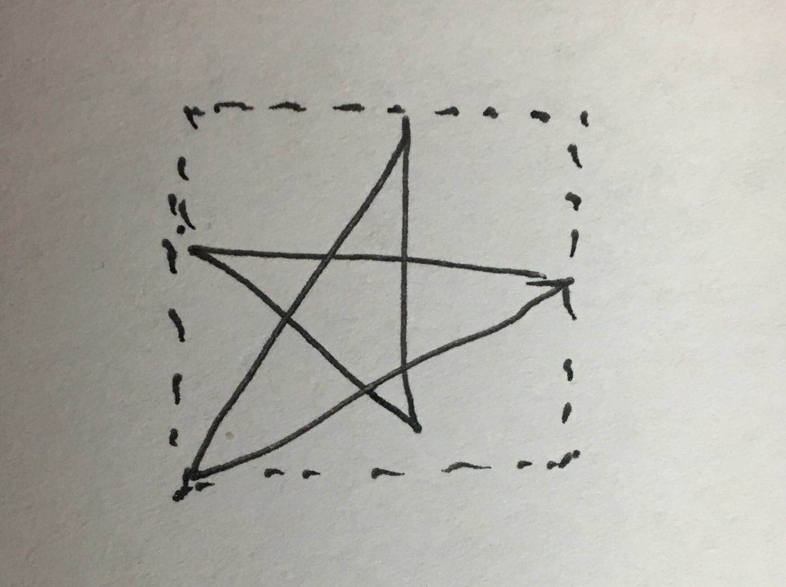
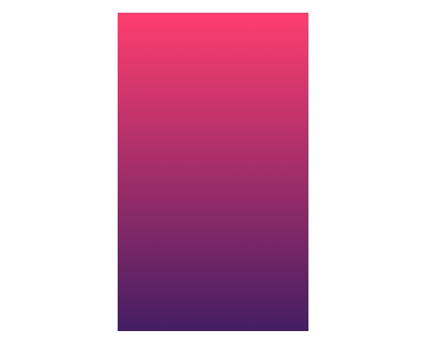
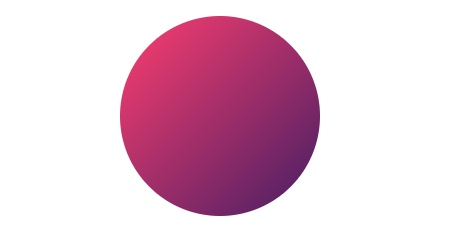
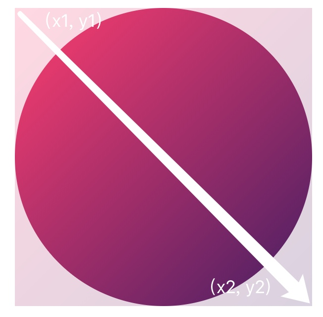
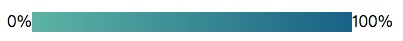
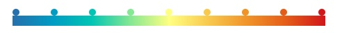
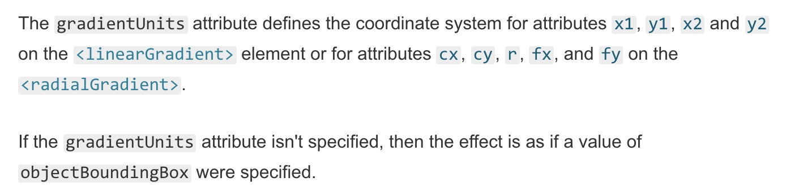
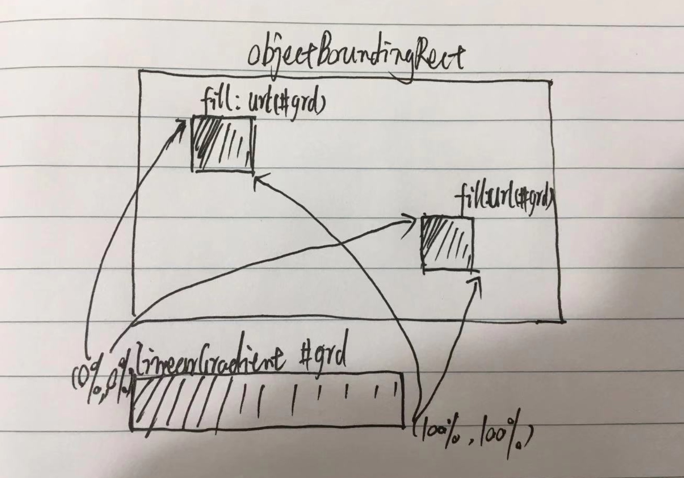
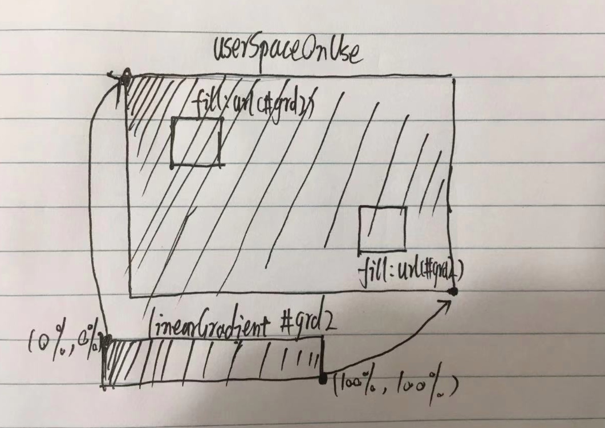
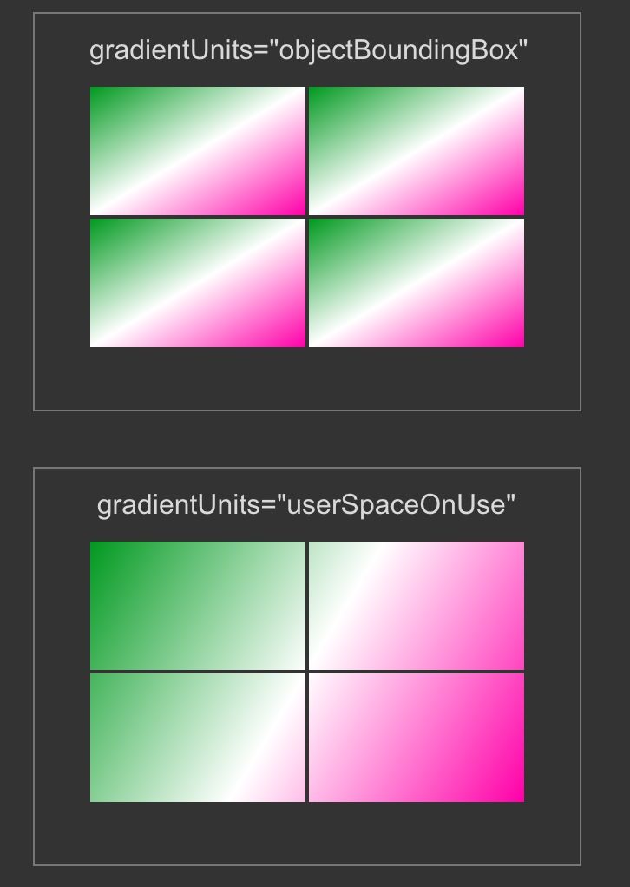

在绘制热力图时，因为需要使用颜色来表示不同程度的值，所以展示的图例通常是一个颜色渐变的矩形。
那要如何来在SVG上实现这个渐变效果呢？
查阅SVG的文档我们找到了一个`linearGradient`元素，通过使用该元素我们可以达成颜色渐变的目的。

### 创建linearGradient

在创建一个`<linearGradient>`之前，我们需要先了解它属于需要**预先定义**的元素，也就是无法直接在svg当中直接使用。需要预先创建一个`<defs>`元素，然后在其中创建需要使用的`linearGradient`并为其赋值唯一id，以方便后面在需要使用的地方指定使用。

多说无益，直接看下面的例子：

```svg
<defs>
  <linearGradient id="liner-gradient">
  </linearGradient>
</defs>
```

实现代码：

```js
const defs = svg.append('defs')

defs.append('linearGradient')
  .attr('id', 'linear-gradient')
```

### 设定颜色渐变方向

`<linearGradient>`元素创建成功啦，下一步我们可以为其赋值属性以达到按需求修改渐变颜色变向的需求。

`linearGradient`元素有`x1`, `x2`, `y1`, `y2`这几个属性，通过设定他们的值我们可以修改渐变颜色的方向和角度（与svg中设定line元素的这几个属性大同小异）。原理很简单，就是设定起点`(x1, y1)`和终点`(x2, y2)`的坐标定义一个向量，要求渐变按照这一向量来变化。

在默认设置中，这两点坐标值构成的向量长被认为与元素的上下/左右边框距离相等，而在非矩形元素中这个边界可以理解为是能包裹该元素的最小矩形。

多说无益，直接看图



<center>就是那个虚线框</center>

若要手动设置这些坐标值，我们可以使用百分比和具体像素值两种方式。例如如果我们想要创建的矩形元素的宽为`300px`，我们设置`x1 = 0%`等价于起始的`0px`；`x2 = 100%` 等价于直接设置`x2 = 300`。**通常情况下我们推荐使用百分比来设定坐标值，令x1为0%;x2为100%。y1、y2赋值形式与前者相同**

```js
// 例1，设置水平颜色渐变效果，只设定x属性的值
linearGradient
  .attr('x1', '0%')
  .attr('y1', '0%')
  .attr('x2', '100%')
  .attr('y2', '0%')
  
// 例2，设置垂直方向颜色渐变，只设定y属性的值
linearGradient
  .attr('x1', '0%')
  .attr('y1', '0%')
  .attr('x2', '0%')
  .attr('y2', '100%')
  
// 例3，斜向下45度渐变，同时设置x2、y2的值
linearGradient
  .attr('x1', '0%')
  .attr('y1', '0%')
  .attr('x2', '100%')
  .attr('y2', '100%')

```


<center>例1</center>



<center>例2</center>



<center>例3</center>

下面我们再仔细看下**例3**，前面提到过，线性渐变生效区间是按照包裹整个元素的最小矩形来计算的，看下图外层包的矩形就是从左上角到右下角是颜色渐变的区间，因此圆形的渐变颜色是预期渐变色区间的子集。



所以已知矩形长宽为100，圆的半径为50。如果我们想要令填充的颜色如我们设定的情况要如何来做呢？

最好的解决办法就是修改`linearGradient`元素的`x`、`y`属性值。让颜色开始和终止的位置分别在圆的左上、右下边两侧。

```js
rotateGradient
  .attr('x1', '12%')
  .attr('y1', '12%')
  .attr('x2', '88%')
  .attr('y2', '88%')
```

### 设定渐变颜色

前文我们只讲了要如何设定渐变色的起始、终止位置，没有说明要如何自定义我们需要的颜色值。那么下面就让我们开始学习要如何来设置颜色。

在`<linearGradient>`中理论上添加的颜色是无上限的，但若想有渐变效果最少要添加两种颜色。因此需要在`<linearGradient>`中创建最少两个`<stop>`元素，以添加你需要的颜色属性。

`<stop>`元素有三个属性：
- `stop-color`： 想要设定的渐变颜色
- `offset`： 在你定义的方向向量上，定义该颜色的生效位置，使用**百分比**来设置具体的存在位置。
- `stop-opacity`： 设定stop-color颜色的透明度

**来个例子**

```js
linearGradient.append('stop')
  .attr("offset", '0%')
  .attr("stop-color“, '#ffa474')
  
linearGradient.append('stop')
  .attr("offset", '100%')
  .attr("stop-color", '#8b0000')
  
svg.append('rect')
  .attr('width', 320)
  .attr('height', 20)
  .attr('fill', 'url(#linear-gradient)')  

```


#### 添加更多的颜色

手动创建一堆`stop`元素太蛋疼了，下面我们来尝试通过数据绑定的方式添加更多的颜色。

**代码例子**

```js
linearGradient.selectAll("stop") 
    .data([                             
        {offset: "0%", color: "#2c7bb6"}, 
        {offset: "12.5%", color: "#00a6ca"},  
        {offset: "25%", color: "#00ccbc"}, 
        {offset: "37.5%", color: "#90eb9d"}, 
        {offset: "50%", color: "#ffff8c"}, 
        {offset: "62.5%", color: "#f9d057"}, 
        {offset: "75%", color: "#f29e2e"},      
        {offset: "87.5%", color: "#e76818"},  
        {offset: "100%", color: "#d7191c"}    
      ])                  
    .enter().append("stop")
    .attr("offset", d => d.offset)   
    .attr("stop-color", d => d.color);

```



上面的方法还可以通过使用比例尺来改进以减少硬编码，并且可以使颜色分布更加均匀。

**例子**

```js
const colorScale = d3.scaleLinear()
  .range(["#2c7bb6", "#00a6ca","#00ccbc","#90eb9d","#ffff8c","#f9d057","#f29e2e","#e76818","#d7191c"])
  
linearGradient.selectAll('stop')
  .data(colorScale.range())
  .enter().append('stop')
  .attr('offset', (d, i) => i / colorScale.range().length - 1)
  .attr('stop-color', d => d)
```


#### 继承线性渐变

很多时候我们使用线性渐变`<linearGradient>`时，需要用到的颜色和起始位置其实是不常改变的，需要改变的主要是渐变的方向和角度。

为此，我们可以使用`xlink:href`的方式来继承之前已经定义好的线性渐变方法，然后通过重新覆盖`x1`、`y1`、`x2`、`y2`的值来修改线性渐变的角度和方向。

**举个栗子**

我们首先先创建一个竖直线性渐变，然后创建一个新的`<linearGradient>`继承它，并赋值为颜色水平线性渐变。

```js
const defs = svg.append('defs')
const l1 = defs.append('linearGradient')
  .attr('id', 'lg-1')
  .attr('x1', '0%')
  .attr('y1', '0%')
  .attr('x2', '0%')
  .attr('y2', '100%')

l1.append('stop')
  .attr("offset", '0%')
  .attr("stop-color“, '#ffa474')
  
l1.append('stop')
  .attr("offset", '100%')
  .attr("stop-color", '#8b0000')

const l2 = defs.append('linearGradient')
  .attr('id', 'lg-2')
  .attr('xlink:href', '#lg-1')  // 继承#lg-1
  .attr('x1', '0%')
  .attr('y1', '0%')
  .attr('x2', '100%')
  .attr('y2', '0%')
```

[Demo代码链接](https://codepen.io/Narcissus_Liu/live/mqvEOg)

#### 更改渐变色的参照坐标系

上面我们所讲的各种例子都是基于svg中各个元素自身参照系来进行渐变的。
其实svg的强大远远不止于此，有时我们希望在svg中所有元素都基于覆盖整个svg的大渐变色来填充颜色。

或许机智如你会想到下面这样的例子，想到让svg下层覆盖一个填充了渐变色的div，然后上层所有svg元素都填充个透明色（没错，最开始我也是这么想的）。

```
<style>
  .gradient {
    position: relative;
    width: 100%;
    height: 100%;
    linear-gradient(0deg, hsl(120,100%,30%), 30%, white 50%, hsl(320,100%,50%));
  }
  svg {
    position: absolute;
    top: 0;
    bottom: 0;
    left: 0;
    right: 0;
  }
</style>
<div class="gradient">
  <svg>
    <circle cx="10" cy="15" r="10"></circle>
    <circle cx="20" cy="25" r="10"></circle>
    <circle cx="30" cy="35" r="10"></circle>
  </svg>
</div>
```

但是，戏剧性的情节往往发生的这么巧。正当我对自己的机智沾沾自喜的时候，[MDN](https://developer.mozilla.org/en-US/docs/Web/SVG/Attribute/gradientUnits)狠狠的打击了我一下，这也是从侧面告诉了我们，MDN是个宝库啊多去查查是有必要滴!

**gradientUnits**，想你所想，急你所急，完美解决你各种不如意。

，

上图翻译过来就是：
> gradientUnits属性定义了<linearGradient>元素上的属性x1、y1、x2和y2的坐标系，或<radialGradient>上的属性cx、cy、r、fx和fy的坐标系。
> 如果gradientUnits属性没有指定，那么效果就像指定了objectBoundingBox的值一样。

看着懵逼不？其实很简单，gradientsUnits属性可以赋予两个值：`userSpaceOnUse`和`objectBoundingBox`。

默认值为`objectBoundingBox`，它会定义渐变色的渐变区间为SVG中引用`<linearGradient>`的区域为参考坐标系，例如rect元素的左上角为渐变色的`0% 0%`位置，右下角为`100% 100%`位置。



而`userSpaceOnUse`则是以整个svg元素视窗区域（viewport）为参考坐标系。就是svg元素的左上角为渐变色的`0% 0%`位置，右下角为`100% 100%`位置。



如果上面两个手绘图你还没让你弄懂的话，那就看下面这个图再来更直观的了解下：



两个图都使用同一个id的`<linearGradient>`元素，通过设置gradientUnits属性值得到了不同的展示效果。

具体怎么使用D3来实现，看下下面的代码吧

```js
const defs = svg.append('defs')
// objectBoundingRect
const l1 = defs.append('linearGradient')
  .attr('id', 'grd1')
  .attr('gradientUnits', 'objectBoundingRect')
  .attr('x1', '0%')
  .attr('y1', '0%')
  .attr('x2', '0%')
  .attr('y2', '100%')

l1.append('stop')
  .attr("offset", '0%')
  .attr("stop-color“, 'hsl(120, 100%, 30%)')
  
l1.append('stop')
  .attr("offset", '40%')
  .attr("stop-color", '#ffffff')
  
l1.append('stop')
  .attr("offset", '100%')
  .attr("stop-color", 'hsl(320, 100%, 50%)')

svg.append('rect')
  .attr('x', 0)
  .attr('y', 0)
  .attr('width', 124)
  .attr('height', 74)
  .attr('fill', 'url(#grd1)')
svg.append('rect')
  .attr('x', 126)
  .attr('y', 0)
  .attr('width', 124)
  .attr('height', 74)
  .attr('fill', 'url(#grd1)')
svg.append('rect')
  .attr('x', 0)
  .attr('y', 76)
  .attr('width', 124)
  .attr('height', 74)
  .attr('fill', 'url(#grd1)')
svg.append('rect')
  .attr('x', 126)
  .attr('y', 76)
  .attr('width', 124)
  .attr('height', 74)
  .attr('fill', 'url(#grd1)')

// userSpaceOnUse
const l2 = defs.append('linearGradient')
  .attr('id', 'grd2')
  .attr('gradientUnits', 'userSpaceOnUse')
  .attr('x1', '0%')
  .attr('y1', '0%')
  .attr('x2', '0%')
  .attr('y2', '100%')

l2.append('stop')
  .attr("offset", '0%')
  .attr("stop-color“, 'hsl(120, 100%, 30%)')
  
l2.append('stop')
  .attr("offset", '40%')
  .attr("stop-color", '#ffffff')
  
l2.append('stop')
  .attr("offset", '100%')
  .attr("stop-color", 'hsl(320, 100%, 50%)')
  
svg2.append('rect')
  .attr('x', 0)
  .attr('y', 0)
  .attr('width', 124)
  .attr('height', 74)
  .attr('fill', 'url(#grd2)')
svg2.append('rect')
  .attr('x', 126)
  .attr('y', 0)
  .attr('width', 124)
  .attr('height', 74)
  .attr('fill', 'url(#grd2)')
svg2.append('rect')
  .attr('x', 0)
  .attr('y', 76)
  .attr('width', 124)
  .attr('height', 74)
  .attr('fill', 'url(#grd2)')
svg2.append('rect')
  .attr('x', 126)
  .attr('y', 76)
  .attr('width', 124)
  .attr('height', 74)
  .attr('fill', 'url(#grd2)')
```

Tips： 尽管MDN很强大，但还有一点是它没有提到的。如果需要给`gradientUnits`赋值为`userSpaceOnUse`时，Svg中使用该渐变色的元素都**不可以**使用`transform`方法。

> 目前在网上没有搜到原因，不过可以猜出是浏览器在对svg的渲染过程中会对`transform`这类方法计算优先级放后，在将对应svg内元素渲染出来之后才执行偏移操作。这时对应的填充样式已经执行渲染完成，所以会导致与预期颜色不符的情况。由于是浏览器本身渲染执行机制导致的，所以暂时只能选择使用`x`、`y`这样直接定位的方式来解决。