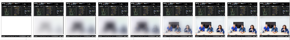

[原文地址](https://jmperezperez.com/medium-image-progressive-loading-placeholder/)

最近，我在[Medium]()浏览帖子的时候发现他们的图片加载效果很赞。首先载入一个模糊的小图片，然后转变为高清大图。这个方法干的真是漂亮，我希望能够知道他是如何办到的。


##Medium的技术
我使用[WebPageTest]()测试这个[页面](https://medium.com/backchannel/exclusive-why-apple-is-still-sweating-the-details-on-imac-531a95e50c91)的载入过程。如果你希望能够测试同样效果，可以打开Medium的页面，通过禁用cache减慢应答过程，会令得到原图资源的时间增长。这样就可以看到整个图片的加载效果。

**下面是具体执行过程**
1. 使用`div`限定好图片展示的作用域，Medium使用`<div>`标签并加入`padding-bottom`样式设定大小对展示应图片的尺寸作为占位符。这样可以防止在图片载入后出现整体页面**回流**的情况。这一方法也被称为[intrinsic placeholders](http://daverupert.com/2015/12/intrinsic-placeholders-with-picture/)

2. **加载一个小尺寸的图片**，此时网页会先请求一个像素质量较渣的小号缩略图（大概20%）.这个小图片使用``标签,因此浏览器会立即请求资源链接。

3. 只要图片开始加载，它就会被画到`<canvas />`中。然后这个图片数据会通过在`main-base.bundle`的JS文件中自定义的一个`Blur()`函数重新计算，可以看到它的效果会很模糊。尽管有些不同，不过该函数与[StackBlur]()的模糊函数是相似的。**在同一时刻，高清原图也会被请求。**

4. 最后原图被加载到页面上，`canvas`会被隐藏，只展示原图。

感谢CSS的动画功能，所有的转变过程都会很流畅。

##Markup
**整个展示图片的结构**
```HTML
<figure>
  <div>
    <div/> <!-- 这个div用于做图片加载过程中的占位符 -->
     <!-- 低像素的缩略图 -->
    <canvas/> <!-- 给上面的缩略图加上模糊效果 -->
     <!-- 展示的高清无码原图 -->
    <noscript/> <!-- fallback for no JS -->
  </div>
</figure>
```

```HTML
<figure name="7012" id="7012" class="graf--figure graf--layoutFillWidth graf-after--h4">
  <div class="aspectRatioPlaceholder is-locked">
    <div class="aspect-ratio-fill" style="padding-bottom: 66.7%;"></div>
    <div class="progressiveMedia js-progressiveMedia graf-image is-canvasLoaded is-imageLoaded" data-image-id="1*sg-uLNm73whmdOgKlrQdZA.jpeg" data-width="2000" data-height="1333" data-scroll="native">
      
        <canvas class="progressiveMedia-canvas js-progressiveMedia-canvas" width="75" height="47"></canvas>
        
        <noscript class="js-progressiveMedia-inner">&lt;img class="progressiveMedia-noscript js-progressiveMedia-inner" src="https://cdn-images-1.medium.com/max/1800/1*sg-uLNm73whmdOgKlrQdZA.jpeg"&gt;</noscript>
    </div>
  </div>
</figure>
```
**PS：实际图片大小要根据设备尺寸来设定。**

##尝试重新实现同样效果
我在[CodePen](http://codepen.io/jmperez/pen/yYjPER)重新实现了同样的效果，通过使用`CSS`而不是`canvas`来实现。下面的图片展示了整个加载过程中，图片的转变效果。



##这么做是否值？
很明显,有很多事情能够呈现这样一个图片,它可以阻止在您的网站上做类似的事情。几年前还是不能通过如此高性能的方式实现动画和模糊效果的，但事实是,大多数时候延迟瓶颈,不是设备的原因,我们值得探索这些技巧。
**控制加载图片过程有以下优点：**
* 懒加载：使用JS来请求资源可以控制选择何种资源。请求同种缩略小图，但是大图则根据浏览器视窗大小不同选择不同尺寸的图片进行加载。
* 更好的占位符： 缩略图添加模糊效果后相比于使用纯色占位符会有更好的视觉效果，同时大小只有2k也不牺牲负载。
* 裁剪图片大小：Medium根据访问设备的不同返回不同尺寸的图片，这样做可以很好的优化页面。

##变体
在实现原方法之前，我觉得可以使用类似技术在我的网站上。
###内联图片数据
代替请求缩略图数据，我们可以直接在`img`中添加**URLs**来直接请求资源。这样做虽然会增加HTML的内容，但是可以加快占位符的生成速度。一生成HTML就立即下载标签资源。模糊效果允许图片很小，我测试了使用0.5k大小的图片与2k大小的图片得到效果相似。
###模糊效果
默认情况下,当浏览器将一个小图像放大,它应用光滑效果处理图像的模糊效果。图像的效果也可以关闭，像QR码。
>[…]the browser would render it in a way that didn’t make it look blocky[…] from [Google Developers](https://developers.google.com/web/updates/2015/01/pixelated).

它可以在Chrome、Safari和Firefox中有效，尽管光滑效果在Chrome中更有效，你可以在[这里](http://codepen.io/jmperez/full/Xmzobe/)看效果。

下面我们看看如何做到光滑效果。图片只有27px宽，并且像素非常低，将它放大会产生很可怕的效果。事实却并没有。如果上述效果能满足你的要求，那你就不需要更复杂的效果替换了。

上述图片模糊效果也可以使用[CSS Filter Effects](http://codepen.io/aniketpant/pen/DsEve)实现，它同时也支持IE浏览器。我相信Medium在使用`canvas`方法之前一定尝试过使用这个功能更强的方法。但是相信是出于一定原因他们放弃了这一方法。**这一方法的优点是你可以设定模糊度，并且可以通过CSS达成其他目的。**

也可以使用**SVG**的filter来达成同样目的，如[The “Blur Up” Technique for Loading Background Images](https://css-tricks.com/the-blur-up-technique-for-loading-background-images/) 和 [Textured Gradients in Pure CSS](http://rentafounder.com/textured-gradients-in-pure-css/)两篇文章提到的。

##其他办法提升占位符：Google 图片搜索
当你在手机上搜索图片时，Googles使用了一种简单的方法来实现图片占位。


他们选择了一种颜色，并用其作为占位块的背景色。这样做会给用户一种图片加载速度更快的感觉。

##更先进的方法：Facebook的200 byte技术
年初Facebook提出了["The technology behind preview photos"](https://code.facebook.com/posts/991252547593574/the-technology-behind-preview-photos/)的文章，使用没有JPEG头的`42 * 42px`图片。
使用场景有些不同，这“图片”被用于Facebook的手机端，它知道如何组成一个有效的JPEG图片。此处我们在Web端使用的话需要编写JavaScript代码，这样做同样会增加存储资源。当然我们可以通过在服务器端组成这个图片解决这一问题，但是这样仍需要一些JavaScript代码发送申请图片资源的请求。

无论如何，这个方法对于Web端来说有点大材小用，但我还是希望能够将其作为一个参考。[Using WebP for generating this preview images](https://jmperezperez.com/webp-placeholder-images/)同样可以节省内存，并且不需要使用如此**创造性**的解决方法。

##LQIP: Low Quality Image Placeholders
与其等待最终的图像呈现,我们可以先提供一个高度压缩的图片,然后切换到大图。这就是[LQIP](http://www.guypo.com/introducing-lqip-low-quality-image-placeholders/)方法的组成。这一方法与Medium相似，不过是使用相同尺寸，但压缩更高的图片。

##总结
随着页面加载的图片越来越多，多思考页面的加载过程是好的。因为这会影响加载效率和用户体验。
如果你生成几个缩略图大小的图片，你可以实验使用一个非常小的图片作为背景，等待最终图片被加载出来。

**其他图片加载技巧：**[ Image optimization: Lossy, lossless and other techniques.
](https://jmperezperez.com/image-optimization-lossy-lossless-techniques)