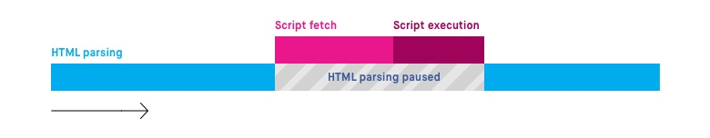

#异步 vs 延迟 JavaScript
> 承接上一篇翻译《理解渲染关键路径》，对其中JavaScript脚本解析时发生的阻塞情况提出优化方案。

如果我们需要加载多个JavaScript文件时，以上行为会导致首次渲染时间难以确定，尽管首页的显示不一定依赖所有的JS文件。

幸运的是，`<script>`标签元素拥有`async`和`defer`两个属性。可以让我们能够更好的控制何时来加载和执行外链文件。

#正常执行
在我们尝试两个属性之前，我们首先先查看默认情况下的执行情况。正如开篇所说，为了加载和执行JavaScript文件，HTML文档的解析工作会被打断。
举个🌰：脚本标签写在HTML页面中间位置：
```HTML
<html>  
<head> ... </head>  
<body>  
    ...
    <script src="script.js">
    ....
</body>  
</html>  
```
下图为当对文档进行解析都发生了什么：


HTML的解析工作会在`<script>`加载及执行时暂停，因此延长了页面的首次加载时长。

#`async`属性
`async`属性用来告诉浏览器脚本文件可以异步执行。HTML解析器不需要暂停在`<script>`处来拉取和执行，执行过程会在脚本被并行拉取到本地之后再进行执行。
```html
<script async src="script.js"> 
```
该属性仅对从外链加载的脚本文件有效。当外链脚本有`async`属性时，文件的下载会与HTML文档的解析工作同时执行。一旦文件下载完成，解析工作会暂停来执行脚本代码。


#`defer`属性
`defer`属性告知浏览器脚本文件只有在HTML被完全解析之后才执行脚本代码。
```html
<script defer src="script.js">  
```
和异步加载脚本类似，在解析HTML文档的过程中可以并行加载脚本文件。但是即使文件已经被全部下载完成，如果文档解析没有结束脚本仍然不会被执行。


#异步，延迟或默认执行？
对于以上三种方式，我们要如何选择？我们需要根据不同状况来选定不同的方法：

##`<script>`标签出现在哪里？
如果`<script>`元素没有放在HTML文档的最后面的话，推荐使用异步或延迟的方式来执行脚本。HTML文档的解析是按顺序的，从`<html>`到`</html>`。如果一个JavaScript的外链文件标签在`</body>`之前，此时`async`，`defer`属性的必要性就没有那么强了。由于解析器此时已经完成了大多数文档的解析工作了，因此到JavaScript文件的解析时也没有太多内容需要再解析了。

##该脚本块是包含吗？
如果脚本文件没有依赖其他文件或自身，异步属性会特别有用。因为我们完全不在意此时文件的执行，因此异步加载是最适合的选择。

##脚本文件是否需要依赖全


[原文链接：Asynchronous vs Deferred](https://bitsofco.de/async-vs-defer/)