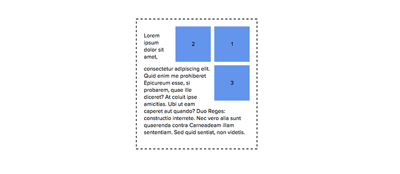
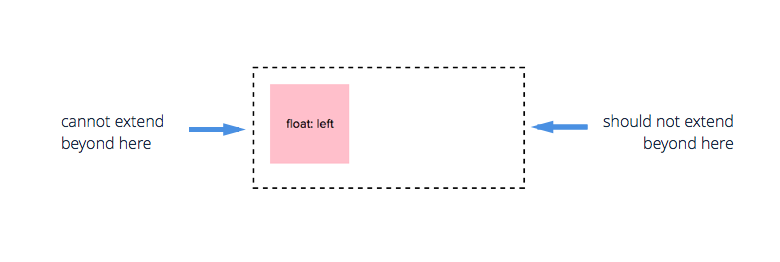
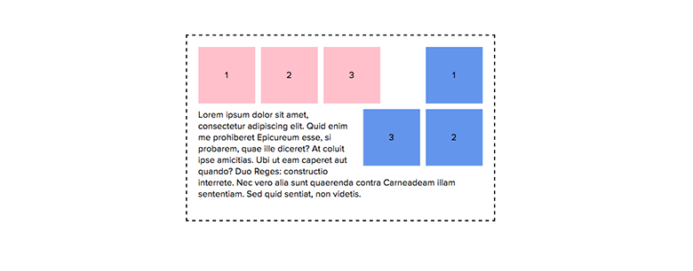

[原文地址](http://bitsofco.de/how-floating-works/#)

尽管我现在很少使用浮动，但在一些特定环境下只能通过使用它来解决问题。在这些特殊例子中我懵逼了，因为我发现他们不会按照我所想象的方式工作。所以我觉得深入研究控制浮动的规则，以及哪些属性会对他们起作用。

#浮动规则
浮动属性可以设定四个值：
```CSS
.foo {
  float: left | right | inherit | none
}
```
上述几个值表明浮动元素在其父元素中如何定位位置，根据文档显示它通常被以下几个规则所决定：

##1. 浮动元素通常对其父元素“不可见”
对所有的意图和目的，**一个浮动元素不存在于其父元素当中**。假如父元素只含有一个浮动子元素，它会表现的像没有任何子元素一样---*高度崩塌*。这和其子元素使用绝对定位的父元素表现的一样。
```CSS
.parent {
  position: relative;
  padding: 10px;
}
.child {
  float: left 
}
```


##2. 一个左/右浮动元素会尽可能的靠向父元素的左/右上方
这是左/右浮动元素尽可能达成的**“最优”**位置。

##3. 提前定义其他元素会导致浮动元素被推到下层
尽管浮动元素会尽可能的靠近父元素的顶部，但是任何其他兄弟元素在文档流中定义它之前，不管前面定义的是块元素还是内联元素（如果它占领了父元素的全部宽度），都会导致将浮动元素推到下层显示。
这意味着，如果我们有一个段落的文字定义在浮动元素之前或之后，我们会得到一个完全不同的结果。


**段落定义在浮动元素之后**


**段落定义在浮动元素之前**

##4. 提前声明一个浮动元素会被定位在一个更合适的位置上
越早被定义的浮动元素，越会被放置在**规则2**中所说明的最佳位置。例如设定右浮动元素，HTML中首个被定义的元素会被放在最佳的位置---最右面。
如下述代码和图例所示：
```HTML
<div class="container">  
  <div class="right">1</div>
  <div class="right">2</div>
  <div class="right">3</div>
  <p>Lorem ipsum dolor sit amet, consectetur adipiscing elit...</p>
</div>  
```


##5. 接近父元素顶部的位置是左/右浮动子元素首选的位置
当在同一容器内有多个同方向的浮动元素时，相对后面的浮动元素为了**更接近顶部**会选择远离父元素的左/右边。
这说明，多个浮动元素在可能的情况下将并排排列，但如果父元素宽度不够的就会移动到下层。



上图中的元素2相对元素3位置更佳。

##6. 浮动元素不应该扩展其父元素
一个左浮动元素**不能**扩展父元素的左外边距。
一个左浮动元素**不应该**扩展父元素的右外边距，除非没有足够的剩余空间。



#清除浮动
`clear`属性和`float`属性是一对相互关联的属性。它可以消除由于浮元素动而对文档流造成的改变。它可以被赋予3个值。
```CSS
.foo {
  clear: left | right | both 
}
```
当一个元素被设定为`clear:left`，意味着被清除元素的上边缘必须低于任意左浮动元素的底部边缘。假如元素同时清除两边浮动，则它的顶部必须在任意方向浮动元素的底部。


假如元素仅仅清除了一个方向的浮动，**则另一个方向的浮动元素不会对该元素产生任何影响。**
```HTML
<div class="container">  
  <div class="left">1</div>
  <div class="left">2</div>
  <div class="left">3</div>

  <div class="right">1</div>
  <div class="right">2</div>
  <div class="right">3</div>

  <p class="clear-left">Lorem ipsum dolor sit amet, consectetur adipiscing elit...</p>
</div>  
```



#Clearfix
之前清除浮动的方法有许多的坑爹的问题，特别对于某些老式浏览器。我选择使用由[CSS Mojo](http://cssmojo.com/latest_new_clearfix_so_far/)提出的一个流行的Clearfix解决方法。以下样式应用于存在浮动属性子元素的**父元素**。

```CSS
.cf::after {
  content:"";
  display:table;
  clear:both;
}
```

你可以阅读博客[内容]()了解为什么要使用这些属性，但是从本质上说，这个解决方法通过创建一个看不见的伪元素来达到清除浮动的目的。
